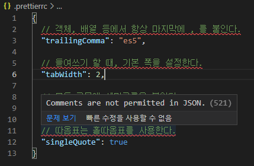
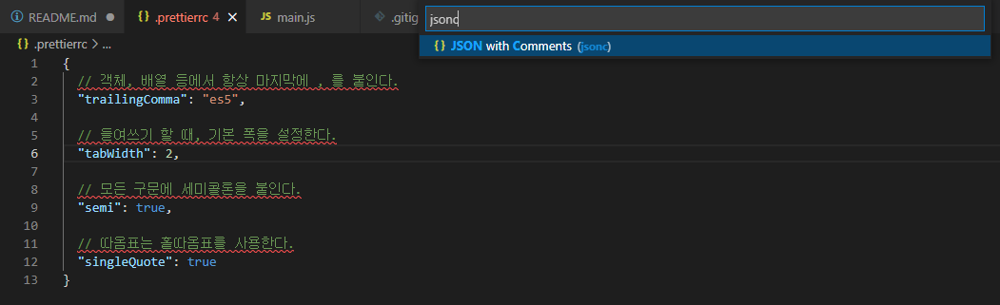

# ESlint + Prettier

1. npm install
```bash
$ npm install eslint  -D
$ npm install prettier -D --save-exact
$ npm install eslint-config-prettier eslint-plugin-prettier -D
```

2. .eslintrc 파일 생성
```json
{
  // 코드 포맷을 prettier로 설정
  "plugins": [
    "prettier"
  ],
  
  // eslint의 룰을 기본 권장설정으로 설정
  "extends": [
    "eslint:recommended",
    "plugin:prettier/recommended"
  ],
  
  // 코드를 해석하는 parser에 대한 설정
  "parserOptions": {
    // 자바스크립트 버전, 7은 ECMA2016
    "ecmaVersion": 7,
    // 모듈 export를 위해 import, export를 사용 가능여부를 설정, script는 사용불가
    "sourceType": "script",
    // jsx 허용을 설정, back-end 설정이기 때문에 사용 안함
    "ecmaFeatures": {
      "jsx": false
    }
  },
  
  // linter가 파일을 분석할 때, 미리 정의된 전역변수에 무엇이 있는지 명시하는 속성
  "env": {
    // 브라우저의 document와 같은 객체 사용 여부
    "browser": false,
    // node.js에서 console과 같은 전역변수 사용 여부
    "node": true
  },
  // ESLint가 무시할 디렉토리, 파일을 설정
  "ignorePatterns": [
    "node_modules/"
  ],
  
  // ESLint 룰을 설정
  "rules": {
    // prettier에 맞게 룰을 설정
    "prettier/prettier": ["error", { "endOfLine": "auto" }]
  }
}
```
3. .prettierrc 파일 생성
```json
{
  // 객체, 배열 등에서 항상 마지막에 , 를 붙인다.
  "trailingComma": "es5",
  
  // 들여쓰기 할 때, 기본 폭을 설정한다.
  "tabWidth": 2,
  
  // 모든 구문에 세미콜론을 붙인다.
  "semi": true,
  
  // 따옴표는 홑따옴표를 사용한다.
  "singleQuote": true
}
```
4. VSCode 확장에서 ESLint, Prettier install
5. 파일->기본설정->설정->
.png)
설정열기(JSON)(오른쪽 위)->settings.json 파일에 아래 코드 추가
```json
{
  // 저장할때 마다 고치기 설정
  "eslint.enable": true,
    "editor.codeActionsOnSave":{
        "source.fixAll.eslint": true
    }
}
```
6. .prettierrc error 해결방법<br/>
에러 화면<br/>
<br/>
해결 방법<br/>
오른쪽 아래 "{} JSON" 클릭 후 JSONC 검색 후 적용<br/>
